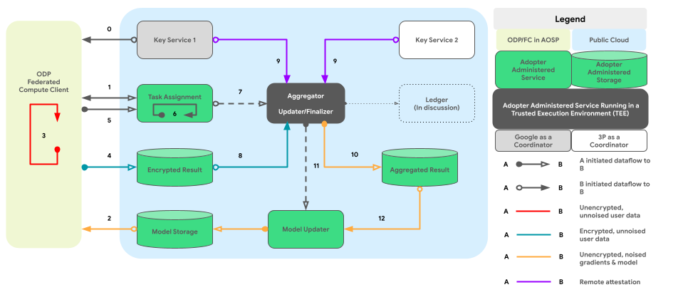

# On-Device Personalization Federated Compute Server

The Federated Compute (FC) Server is part of Federated Learning offered by [On-Device Personalization](https://developers.google.com/privacy-sandbox/protections/on-device-personalization).

## Overview - A Round of Training Flow
To better understand the server, it is helpful to first describe the flow of a single round of training. Training consists of data flows between the ODP Federated Compute Client (FC Client) that is a core module in the Android Open Source Project (AOSP).  Because it is a core module of Android, the interaction in these flows that occur on the FC Client are on device.  The Aggregator is a component built within a Trusted Execution Environment (TEE) available on a public cloud in its current design.

Training consists of the following steps:


0. The Federated Compute client on the device downloads a public encryption key from key services.
1. The Federated Compute client checks in with the server and gets a training task.
2. The Federated Compute client downloads training plan, plus the last version of The model, version N.
3. The Federated Compute client trains with the local data and the plan.
4. The Federated Compute client encrypts this device’s contributions with the public key obtained in Step 0 and uploads it to the Federated Compute server.
5. The Federated Compute client notifies the Federated Compute server that its training has completed.
6. The Federated Compute server waits until enough clients have submitted their contributions.
7. A round of aggregation is triggered.
8. Encrypted contributions are loaded into a Trusted Execution Environment (TEE) by the Aggregator.
9. The Aggregator attests itself, following NIST's [RFC 9334 Remote ATtestation procedureS (RATS) Architecture](https://www.rfc-editor.org/rfc/rfc9334), to the coordinators. Upon success attestation, the key services grant it the decryption keys. These keys may be split across multiple key providers in a [shamir secret sharing](https://en.wikipedia.org/wiki/Shamir%27s_secret_sharing) scheme.
10. The Aggregator does cross-device aggregation, clips and noises per appropriate Differential Privacy (DP) mechanisms, and outputs the noised results.
11. The Aggregator triggers the Model Updater.
12. The Model Updater loads the aggregated contribution and applies it to model version N to create model version N + 1. The new model is pushed to the model storage.


This Federated Compute service would be deployed on cloud service(s) which support TEEs and needed security features. As we evaluate cloud providers and underlying technologies, we have focused on a Google Cloud implementation using [Confidential Space](https://cloud.google.com/docs/security/confidential-space).

## Important: This is a preview release
This is a preview version of the On-Device Personalization Federated Compute Server and should be used for testing and evaluation purposes. As such, there are not yet any guarantees about forward/backward source compatibility. It is currently not recommended for use in production settings.

## Devenv setup
0. Install [Extension Pack for Java](https://marketplace.visualstudio.com/items?itemName=vscjava.vscode-java-pack)
0. Install [Bazel](https://marketplace.visualstudio.com/items?itemName=BazelBuild.vscode-bazel)
0. Install [Bazel extension for Java](https://marketplace.visualstudio.com/items?itemName=sfdc.bazel-vscode-java)
1. Install required packages
```
sudo apt-get update
sudo apt-get install --no-install-recommends -y \
    curl \
    unzip \
    zip \
    xz-utils \
    wget \
    default-jdk \
    libtinfo5 \
    g++ \
    python3 \
    jq
```
2. Download & install bazelisk
```
wget https://github.com/bazelbuild/bazelisk/releases/download/v1.26.0/bazelisk-amd64.deb
sudo dpkg -i bazelisk-amd64.deb
```
3. Setup docker:
```
# 1-A Remove any old Docker packages
sudo apt remove docker docker-engine docker.io containerd runc

# 1-B Add Docker’s GPG key & repository (instructions Feb 2025)
sudo install -m 0755 -d /etc/apt/keyrings
curl -fsSL https://download.docker.com/linux/ubuntu/gpg \
  | sudo tee /etc/apt/keyrings/docker.asc >/dev/null
sudo chmod a+r /etc/apt/keyrings/docker.asc

echo \
  "deb [arch=$(dpkg --print-architecture) signed-by=/etc/apt/keyrings/docker.asc] \
  https://download.docker.com/linux/ubuntu $(lsb_release -cs) stable" \
  | sudo tee /etc/apt/sources.list.d/docker.list >/dev/null

# 1-C Install Engine + Compose plug-in
sudo apt update
sudo apt install docker-ce docker-ce-cli containerd.io docker-buildx-plugin docker-compose-plugin

sudo usermod -aG docker $USER
newgrp docker
```
4. Run local setup:
```
./scripts/docker/run_all_services_docker.sh
```
5. Further run:
```
bazel run java/src/it/java/com/google/ondevicepersonalization/federatedcompute/endtoendtests:end_to_end_test -- --server http://localhost:8080  --task_management_server http://localhost:8080 --encrypt false
```
